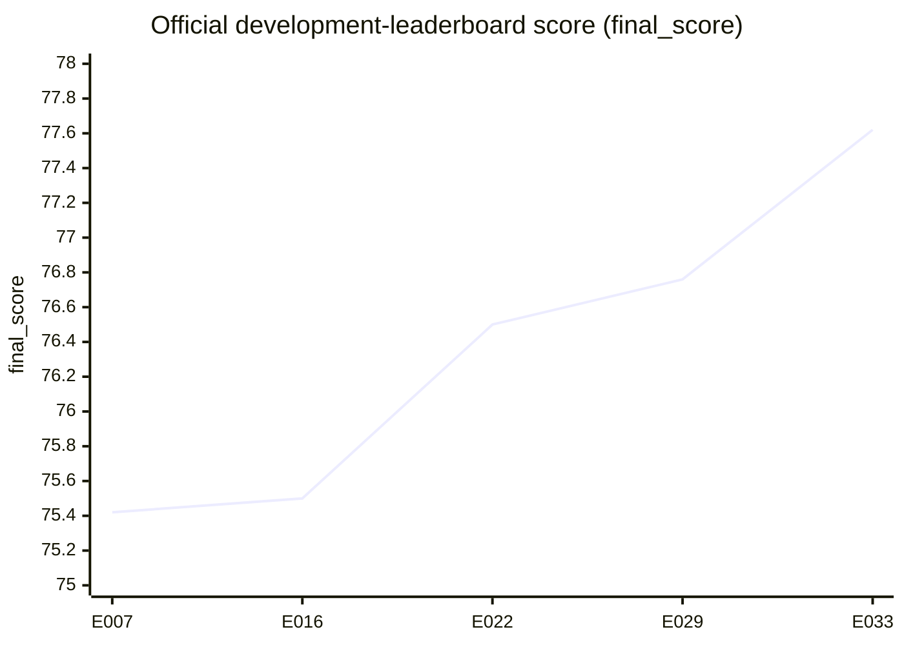

<h1 align="center">RealPDE · Track 2 — Long-Term Test-Time Adaptation</h1>

<p align="center">
  <b>Forecasting a live, real-world flow and learning from every measurement as it arrives.</b>
</p>

<p align="center">
  <a href="https://realpdecompetition.github.io/"></a>
  <a href="https://www.codabench.org/competitions/17385/"></a>
  <a href="RESULTS.md"></a>
  
  
  <a href="LICENSING.md"></a>
</p>

<p align="center">
  <a href="METHOD.md">Method</a> ·
  <a href="RESULTS.md">Results</a> ·
  <a href="LEDGER.md">Experiment ledger</a> ·
  <a href="REPRODUCING.md">Reproducing</a>
</p>

---

## Forecasting on the job

Most forecasting benchmarks hand a model one window, check its answer, and move
on. Track 2 of the [RealPDE Competition](https://realpdecompetition.github.io/)
works more like deployment. The model watches a real, measured flow past an
airfoil **as one long, ordered stream**:

```text
 observe 20 frames ─▶ forecast the next 20 ─▶ the truth is revealed ─▶ adapt ─▶ forecast again ─▶ …
```

Each revealed window becomes the next **measured input**; predictions are not
fed back as future inputs. The challenge is to correct persistent bias and
fluctuation errors as the measured flow evolves. The rules are strict: a forecast
may only learn from targets that have *already* been revealed, and everything
the model adapts has to be wiped clean when a new trajectory begins.

<p align="center">
  
</p>
<p align="center">
  <sub>An illustration I generated, not competition data: the wake of a NACA4418 airfoil from a small lattice-Boltzmann simulation (left), and the same flow degraded the way PIV measurements are (right). <a href="docs/assets/README.md">How it was made</a></sub>
</p>

That's the catch. The model starts out trained on clean simulations like the
left panel, but the stream it has to keep up with is measured, like the right:
affected by measurement noise and differences from the simulated flow. (The
[competition website](https://realpdecompetition.github.io/#about) shows the
real side-by-side.)

> **Scored on:** field accuracy (Rel-L2), turbulent kinetic energy (TKE), the
> mean wake profile (MVPE), speed, and the quality of its uncertainty bounds
> (SPS).

## What I did

My best submission, **E033**, doesn't retrain anything during the stream. Instead
of running gradient updates on the fly, which I tried and found slow for very
little gain, it keeps a few cheap running statistics and uses them to nudge
each new forecast.

**1 · Split the forecast into "average" and "wiggle."** I started from the
organizers' simulation-pretrained **Fourier neural operator (FNO)** and gave it
two output heads: one for the temporal-mean flow and one for the zero-mean
fluctuations around it. Their sum is the forecast. The simulation checkpoint's
final layer is copied into both heads, preserving the original mapping up to
floating-point roundoff. I check loaded parameters tensor by tensor and test
forward equivalence within numerical tolerance.

**2 · Fine-tune on real flow.** 1800 updates on all 81 valid real trajectories,
sampling each trajectory equally so long ones don't dominate.

**3 · Adapt while streaming.** Each time a target is revealed:

| Running statistic | What it corrects |
| :--- | :--- |
| **Mean-bias EMA** (decay 0.90): how far off my last forecast's average was | Systematic drift in the mean flow |
| **Per-pixel variance EMA** (decay 0.90): how much the real flow is fluctuating | Fluctuations that are too weak or too strong. They get rescaled by a bounded, smoothed ratio. |

**4 · Say how unsure it is.** Calibrated symmetric intervals
`pred ± half_width`, where the physical-space half-width is
`0.020·abs(pred) + 0.140·σ_global` and `σ_global = 0.0563870259` is the
organizer's fixed scale, not a learned per-pixel uncertainty. Bounds are then
returned in normalized space, with finite-value guards.

**5 · Reset at every trajectory boundary.** No state, cache or statistic leaks
from one trajectory to the next.

The details, configs and caveats are in **[METHOD.md](METHOD.md)**.

## The journey

Every point below is an official development-leaderboard score I recorded from
Codabench—not a final private-test ranking or a fresh reproduction. Getting there
took **30-plus numbered experiments** over the competition.



| Submission | What changed | Score |
| :--- | :--- | ---: |
| E007 | First validated streaming package | 75.42 |
| E016 | Same FNO recipe, refit on all real trajectories | 75.50 |
| E022 | Dual-head (mean + fluctuation) FNO with streaming mean-bias correction | 76.50 |
| E029 | Per-pixel streaming variance adaptation (TKE **+6.6** over E022) | 76.76 |
| **E033** | **Verified simulation initialization + balanced sampling + longer training** | **77.62** |

<details>
<summary><b>E033's full score breakdown</b></summary>
<br />

| What was measured | Metric | Score |
| :--- | :--- | ---: |
| Flow-field accuracy | Rel-L2 | 93.614317 |
| Turbulent energy | TKE | 77.141376 |
| Mean wake profile | MVPE | 93.391126 |
| Inference speed | Time | 88.185671 |
| Uncertainty quality | SPS | 32.109079 |
| **Overall** | **final_score** | **77.615784** |

E033 improved all four quality metrics over E029, while Time dipped slightly.
It combined several changes, so one server comparison can't say which one mattered
most. These are the development-leaderboard results I recorded from Codabench,
not a final private-test ranking or a fresh reproduction.
[Full results and caveats →](RESULTS.md)

</details>

## What didn't work (and what it taught me)

- **🐢 Gradient-based test-time training.** Updating the whole model, or just
  its last layer, on each revealed window cost runtime and bought almost
  nothing. Simple running statistics did far more.
- **🕵️ The initialization that wasn't.** A checkpoint-loading bug left
  **E021**, the model behind E022/E029, at **random weights** instead of loading
  its configured E004 real-finetuned checkpoint. After fixing the loader, the
  separate [E031 study](docs/E031_RESULTS.md) showed that official simulation
  initialization improved every quality metric in all four fold/seed checks.
  The [E021 record](docs/E021_RESULTS.md) is corrected; E020's earlier history
  remains qualified. Initialization is now verified from loaded tensors, not
  trusted from a config label.
- **🌀 Mixing simulation into fine-tuning.** Training jointly on simulated and
  real data, without aligning them first, collapsed the turbulent energy score.
- **📉 Fancier uncertainty and feedback.** Learned variance heads, coverage
  feedback, residual feedback and input blending either failed their gates or
  lost to the plain variance-EMA approach.
- **☁️ Not every failure is yours.** One submission failed because the platform
  couldn't fetch the organizers' ingestion bundle, before my code even ran.

Every experiment, the dead ends included, is in the
**[experiment ledger](LEDGER.md)** and the per-experiment notes in
[`docs/`](docs/).

## Find your way around

| If you want to… | Go to |
| :--- | :--- |
| Understand the approach | [METHOD.md](METHOD.md) |
| See the numbers and their caveats | [RESULTS.md](RESULTS.md) · [E033 notes](docs/E033_RESULTS.md) |
| Follow the whole research story | [LEDGER.md](LEDGER.md) · [literature notes](TRACK2_LITERATURE_NOTES.md) · [task reference](TRACK2_REFERENCE.md) |
| Read the code | [`src/realpde_t2/`](src/realpde_t2/) · [`scripts/`](scripts/) · [`configs/`](configs/) · [`submission/`](submission/) |
| Rebuild the environment | [REPRODUCING.md](REPRODUCING.md) · [EXTERNAL_DEPENDENCIES.md](EXTERNAL_DEPENDENCIES.md) · [`environment-locks/`](environment-locks/README.md) |

## Before you clone: what's in the box

This is a **research archive**, not a pretrained model you can download and run.

- ✅ **Included:** my source code, configurations, contract tests, per-experiment
  result notes, and pinned dependency snapshots for reconstructing the environments.
- ❌ **Not included:** competition data, trained checkpoints, generated
  submission archives, installed environments, or the organizer starter kit.
  Data, learned weights and generated submissions were deleted during cleanup
  after the development phase. The organizer kit was deliberately excluded from
  this public export; obtain it separately under its terms.
- ⚠️ **Not re-run:** reproducing E033 means reacquiring the data and retraining.
  I haven't done a fresh end-to-end run since the cleanup. See
  [REPRODUCING.md](REPRODUCING.md).

You can check the archive right away. No GPU, data or packages needed:

```bash
python3 -B scripts/check_archive.py
python3 -B scripts/publication_audit.py
```

These check source integrity, license headers and release hygiene, **not**
model quality. Clone as `RealPDE_T2` if you want paths to match the original
workspace layout.

> **Sibling project:** `realpde-track1` covers Track 1, where a
> simulation-trained model has to transfer to real measurements.

## Credits & license

Built by **Pranay Vandanapu**, with AI coding assistance
([details](ACKNOWLEDGMENTS.md)). Huge thanks to the RealPDE organizers and the
RealPDEBench team for the dataset, the baselines and a genuinely interesting
problem. The flow animation is my own illustration, made with a small
script ([how it was made](docs/assets/README.md)).

My original code is **MIT-licensed**, but **not the whole repository**. Five
files adapt FNO code from RealPDEBench and are **CC BY-NC 4.0**
(non-commercial). They're listed in [LICENSING.md](LICENSING.md) and carry
their own headers. See also [THIRD_PARTY_NOTICES.md](THIRD_PARTY_NOTICES.md) ·
[PUBLICATION_AUDIT.md](PUBLICATION_AUDIT.md).
